#  Northwind Traders KPI dashboard
Build a top-level KPI dashboard to help Northwind Traders' executives quickly understand the company's performance in key areas.

# Objective 
Northwind Traders global import and export company that specializes in supplying high-quality gourmet food products to restaurants, cafes, and specialty food retailers around the world.

Its purpose should be to allow them to quickly understand the company's performance in key areas, including:

* Sales trends
* Product performance
* Key customers
* Shipping costs

# About The Data Set 
The Data set is current and provide all the necessary requirements for work . 
Sales & order data for Northwind Traders, a fictitious gourmet food supplier, including information on customers, products, orders, shippers, and employees. 
Data contain multiple tables , such as 
* Orders 
* Order detail 
* Customers 
* Products
* Product categories
* Employees
* Shippers

The Northwind Traders' also provide Entity Relationship (ER) Diagram. 

# ASK 

KPI dashboard 
* Sales trends
* Product performance
* Key customers
* Shipping costs 

# Description 
Data sourse : https://mavenanalytics.io/challenges/maven-northwind-challenge/24

Data Provided on  May 04, 2023 , contains 2013,2014,2015 years data.

 
* Orders.csv  8 columns and 500 rows ()
* Order detail.csv  5 columns  and 500 rows 
* Customers.csv  6 columns and 92 rows 
* Products.csv 6 columns and 78 rows 
* Product categories.csv have 3 columns and 9 rows 
* Employees.csv 6 columns and 10 rows 
* Shippers 2 columns and 3 rows 

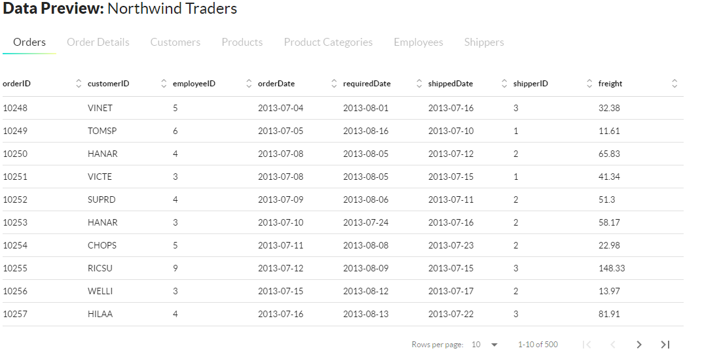
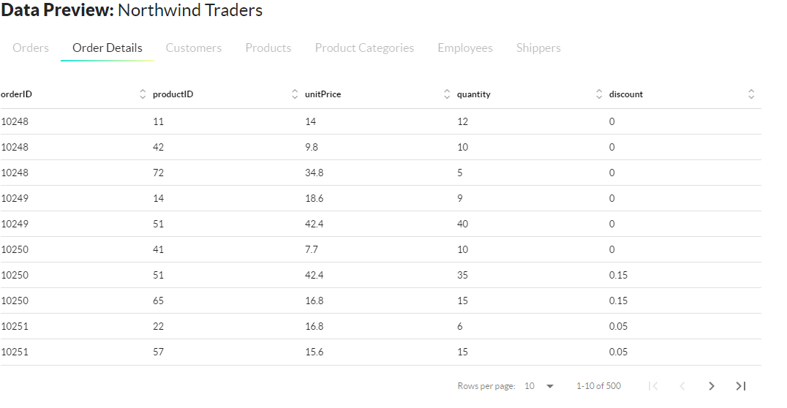
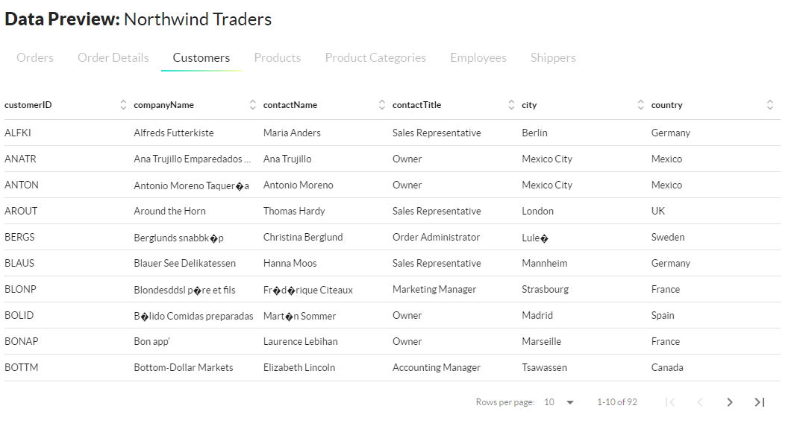
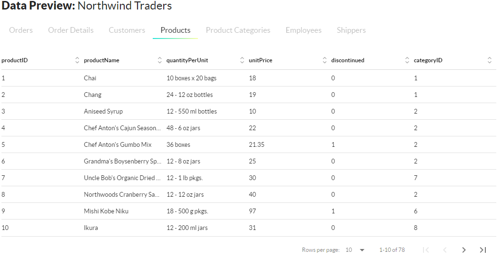
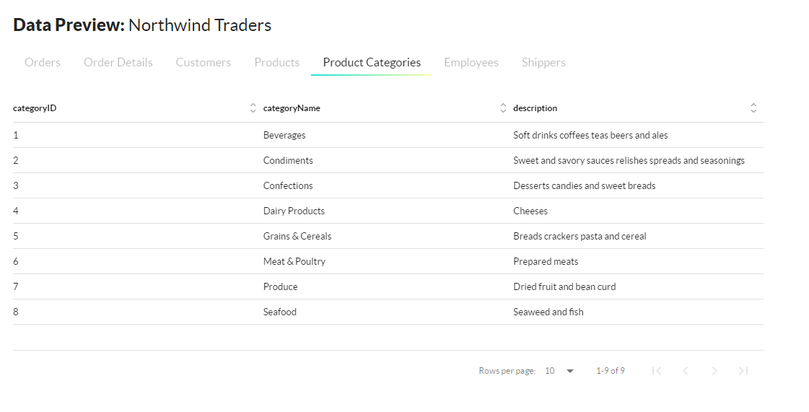
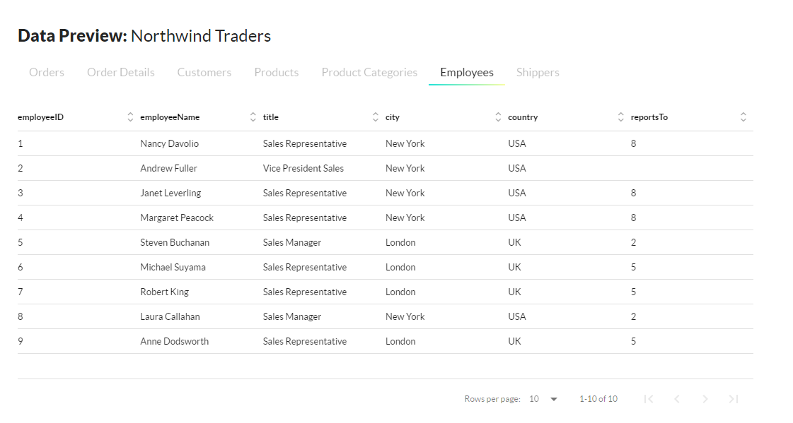
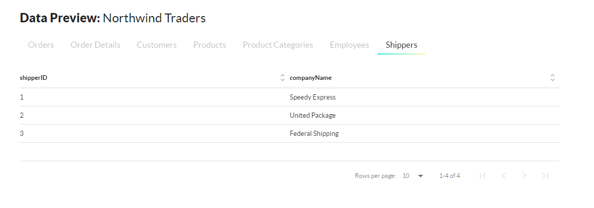
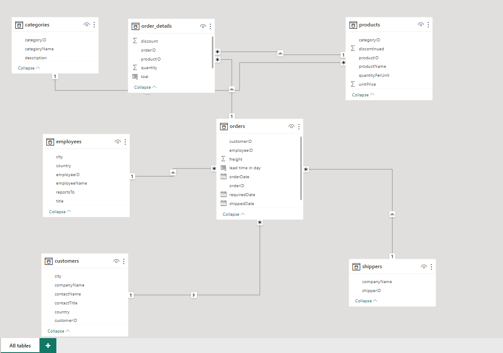

# instructions 
 how to use the dashboard ?
 * When you open the Maven Northwind Challenge.pbix file in Power Bi, You can able to visualize  4 Dashboard and a drill through page.
 * The 1st Page is the Sales Dashboard. You can check the overall sales also there is options for drill up or drill down in each charts. 
 * To visualize sales numbers more you can check the drill 1 page so you can check yearly quarterly sales . 
 * Page 2 is the Products performance dash board. You can check best selling peoducts and revenue from the products and also there is options for filters like yearly,quarterly and a contries . so you can adjust the filter to check different types of revenue for the products . also there is options for discontinued products and there performences . 
 * The next Dashboard is all about Employees performence. there is filter options for the London and New York wo you can adjust the filters and also there is Year filter . 
 you can check the numbers of customers in different years which you can dill through Quaterly and monthly . 
 * The 4th page is shipping Cost and shipping related Dashboard . You can adjust the month year and shipping company filters to find insights. 
 

# KPI DASHBOARD PREVIEW 
The KPI dashboard present in the Project Folder.Maven Northwind Challenge.pbix is a Microsoft Power BI file . 
 Here I present some demo of my project which consist of Sales Dashboard , Product performence Dashboard , Employe performence Dashboard and Shippings Dashboard . 
 * Sales Dashboard 
 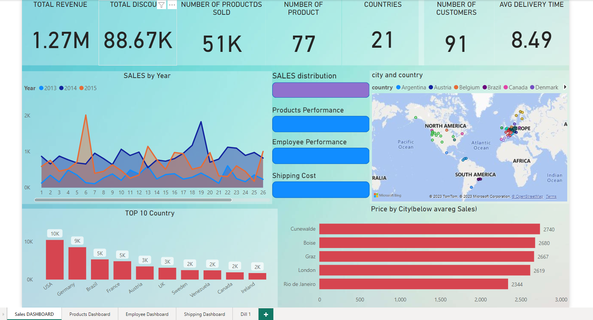 
 * Product_performence_dashboard
 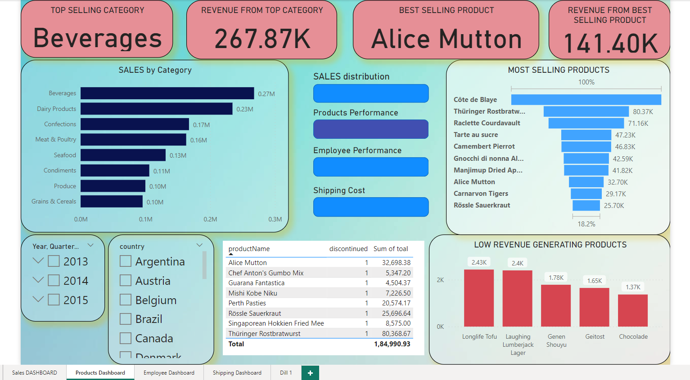 
 * Employe_performence_DAshboard
 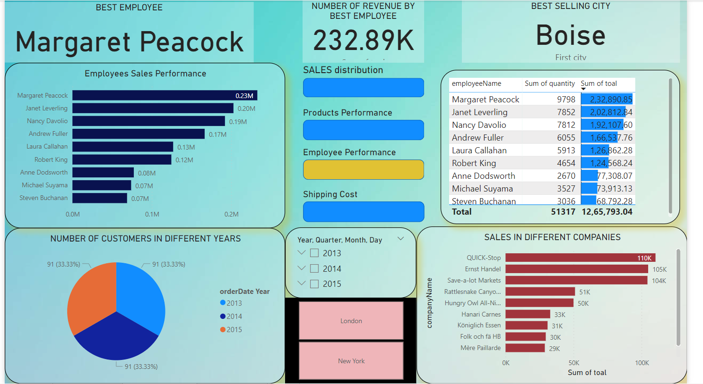 
 * Shippings Dashboard
 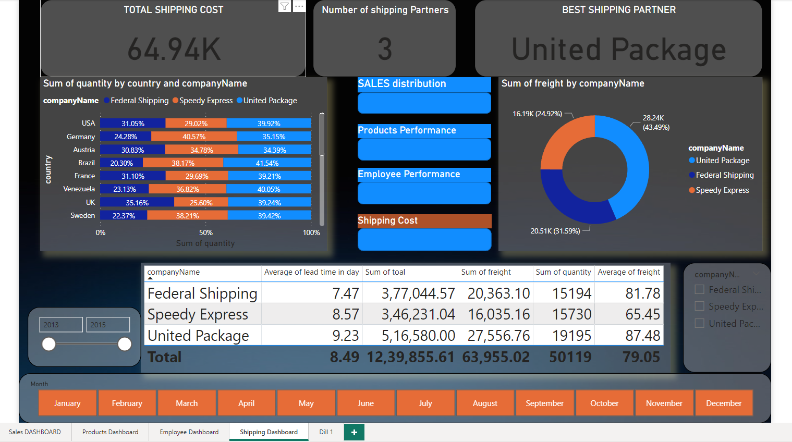 

 