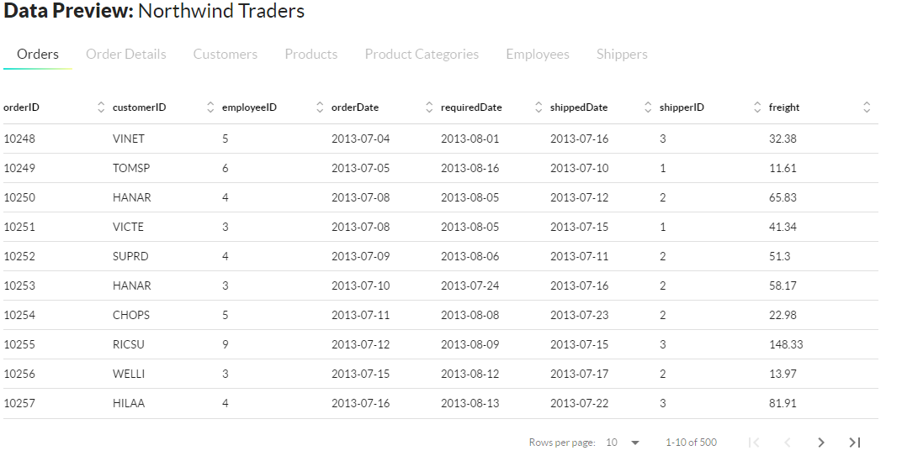

#  Northwind Traders KPI dashboard
Build a top-level KPI dashboard to help Northwind Traders' executives quickly understand the company's performance in key areas.

# Objective 
Northwind Traders global import and export company that specializes in supplying high-quality gourmet food products to restaurants, cafes, and specialty food retailers around the world.

Its purpose should be to allow them to quickly understand the company's performance in key areas, including:

* Sales trends
* Product performance
* Key customers
* Shipping costs

# About The Data Set 
The Data set is current and provide all the necessary requirements for work . 
Sales & order data for Northwind Traders, a fictitious gourmet food supplier, including information on customers, products, orders, shippers, and employees. 
Data contain multiple tables , such as 
* Orders 
* Order detail 
* Customers 
* Products
* Product categories
* Employees
* Shippers

The Northwind Traders' also provide Entity Relationship (ER) Diagram. 

# ASK 

KPI dashboard 
* Sales trends
* Product performance
* Key customers
* Shipping costs 

# Description 
Data sourse : https://mavenanalytics.io/challenges/maven-northwind-challenge/24

Data Provided on  May 04, 2023 , contains 2013,2014,2015 years data.

 
* Orders.csv  8 columns and 500 rows ()
* Order detail.csv  5 columns  and 500 rows 
* Customers.csv  6 columns and 92 rows 
* Products.csv 6 columns and 78 rows 
* Product.csv categories.csv have 3 columns and 9 rows 
* Employees.csv 6 columns and 10 rows 
* Shippers 2 columns and 3 rows 

